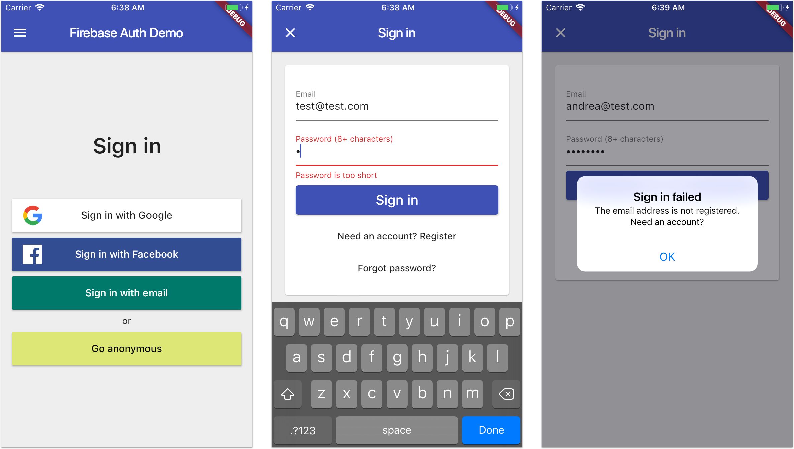
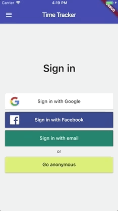
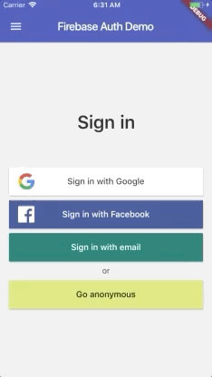
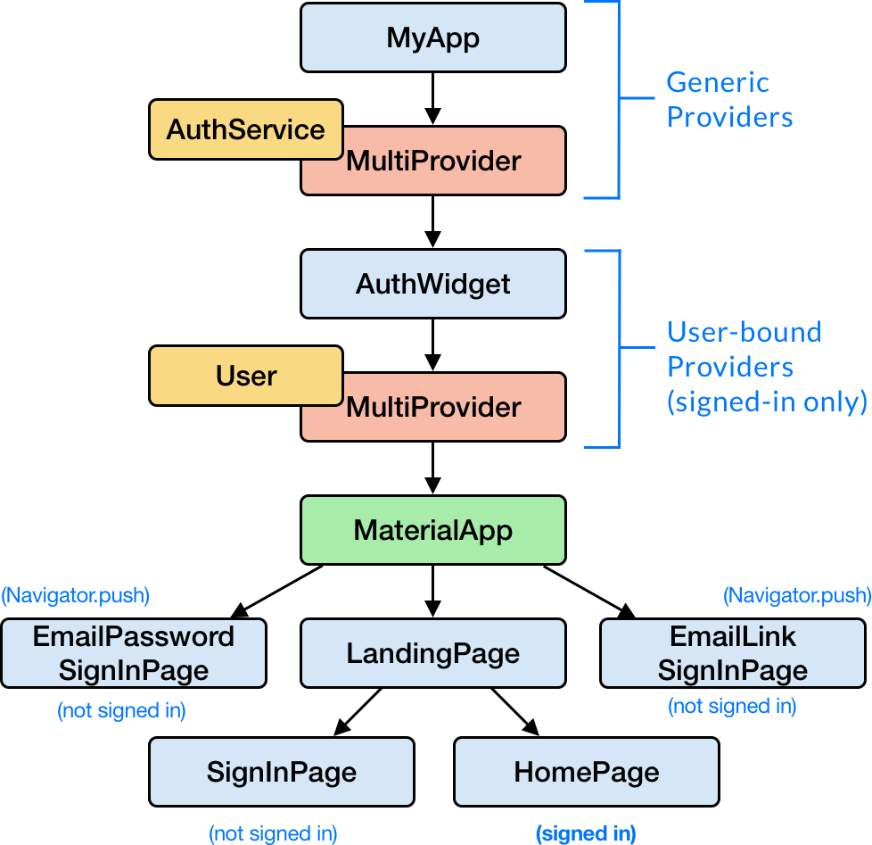

# Reference Authentication Flow with Flutter & Firebase

YouTube video walk-throughs here: 

This project shows how to implement a full authentication flow in Flutter, using various Firebase sign-in methods.

It aims to be a reference implementation. Think of it as "authentication done right".

## Project goals

This project shows how to:

- use the various Firebase sign-in methods
- build a robust authentication flow
- use appropriate state management techniques to separate UI, logic and Firebase authentication code
- handle errors and present user-friendly error messages
- write production-ready code following best practices

Feel free to use this in your own projects. 😉

_NOTE: This project will be kept up to date with the latest packages and Flutter version._

## Preview

**Google Sign-in**

**Facebook Sign-in**

**Email & Password auth**

## Simplified widget tree

## FirebaseAuth features

### Supported sign-in methods

- [x] Anonymous
- [x] Email & Password
- [x] Email link (passwordless) (see [documentation](docs/sign-in-email-link.md))
- [x] Facebook
- [ ] GitHub
- [x] Google
- [x] Apple
- [ ] Phone
- [ ] Twitter

### Link account with third-party providers

- [ ] Email & Password
- [ ] Facebook
- [ ] GitHub
- [ ] Google
- [ ] Phone
- [ ] Twitter

### Other authentication features

- [ ] Email verification (for email & password sign-in)
- [x] Password reset
- [ ] Sign-in with custom token

## Application features

### Sign-in Page

- [x] Navigation to email and password sign-in
- [x] Apple sign-in
- [x] Google sign-in
- [x] Facebook sign-in
- [x] Anonymous sign-in

### Email & password page

- [x] Custom submit button with loading state
- [x] Disable all input widgets while authentication is in progress
- [x] Email regex validation
- [x] Error hints
- [x] Focus order (email -> password -> submit by pressing "next" on keyboard)
- [x] Password of at least 8 characters
- [ ] Show/hide password
- [x] Password reset flow

### Email link page

- [x] Email input field, backed by secure storage

### Authentication

- [x] Abstract `AuthService` class, modeled after the `firebase_auth` API
- [x] `FirebaseAuthService` implementation
- [x] `MockAuthService` for testing
- [x] Firebase project configuration for iOS & Android
- [x] Toggle `FirebaseAuthService` and `MockAuthService` at runtime via developer menu

### Architecture

- [x] Logic inside models for better separation of concerns (using [`ChangeNotifier`](https://api.flutter.dev/flutter/foundation/ChangeNotifier-class.html))
- [x] Use [Provider package](https://pub.dev/packages/provider) for dependency injection

### Other

- [x] Platform-aware alert dialogs for confirmation/error messages
- [x] Fully compliant with the official Flutter `analysis_options.yaml` rules

## TODO

- [ ] Internationalization
- [ ] Full test coverage
- [ ] Improve documentation

## Running the project with Firebase

To use this project with Firebase authentication, some configuration steps are required.

- Create a new project with the Firebase console.
- Add iOS and Android apps in the Firebase project settings.
- On Android, use `com.codingwithflutter.firebase_auth_demo_flutter` as the package name (a SHA-1 certificate fingerprint is also needed for Google sign-in).
- then, [download and copy](https://firebase.google.com/docs/flutter/setup#configure_an_android_app) `google-services.json` into `android/app`.
- On iOS, use `com.codingwithflutter.firebaseAuthDemo` as the bundle ID.
- then, [download and copy](https://firebase.google.com/docs/flutter/setup#configure_an_ios_app) `GoogleService-Info.plist` into `iOS/Runner`, and add it to the Runner target in Xcode.

See this document for full instructions:

- [https://firebase.google.com/docs/flutter/setup](https://firebase.google.com/docs/flutter/setup) 

Additional setup instructions for Google and Facebook sign-in:

- Google Sign-In on iOS: [https://firebase.google.com/docs/auth/ios/google-signin](https://firebase.google.com/docs/auth/ios/google-signin)
- Google Sign-In on Android: [https://firebase.google.com/docs/auth/android/google-signin](https://firebase.google.com/docs/auth/android/google-signin)
- Facebook Login for Android: [https://developers.facebook.com/docs/facebook-login/android](https://developers.facebook.com/docs/facebook-login/android)
- Facebook Login for iOS: [https://developers.facebook.com/docs/facebook-login/ios](https://developers.facebook.com/docs/facebook-login/ios)

## Additional References

A lot of the techniques used in this project are explained in great detail, and implemented step-by-step in my Flutter & Firebase Udemy course.

This is available for early access at this link (discount code included):

- [Flutter & Firebase: Build a Complete App for iOS & Android](https://www.udemy.com/flutter-firebase-build-a-complete-app-for-ios-android/?couponCode=DART15&password=codingwithflutter)

## [License: MIT](LICENSE.md)
