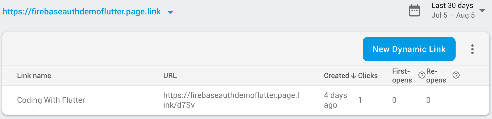
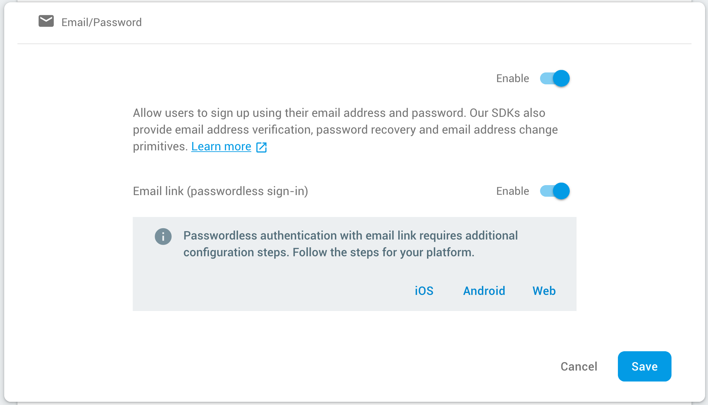
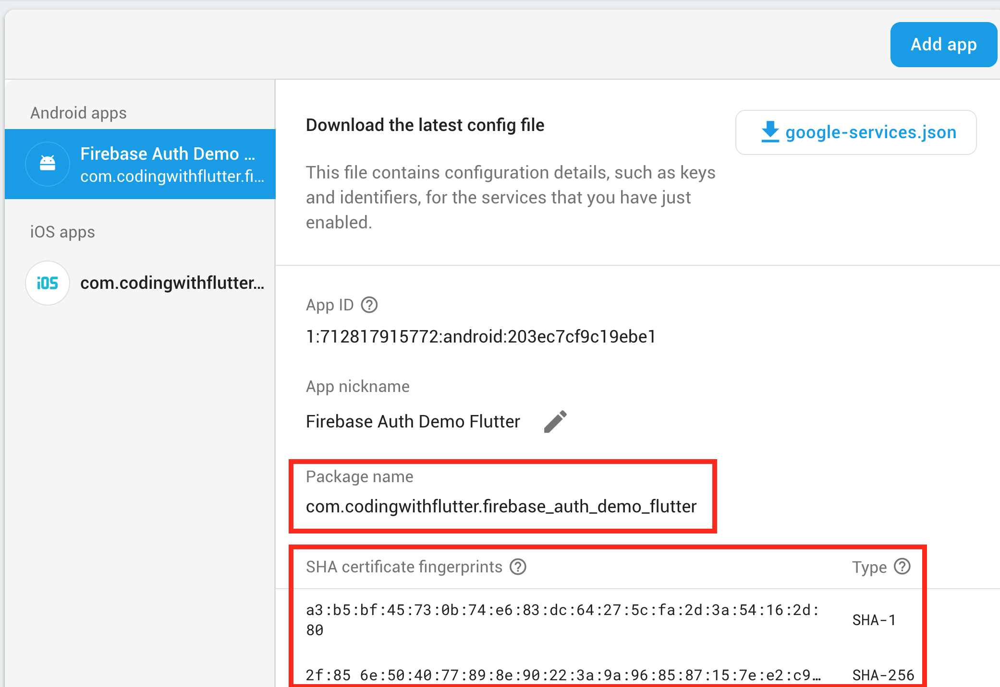
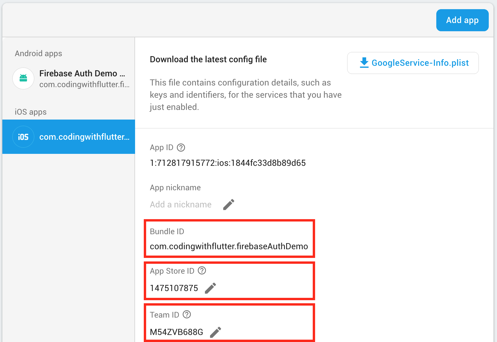
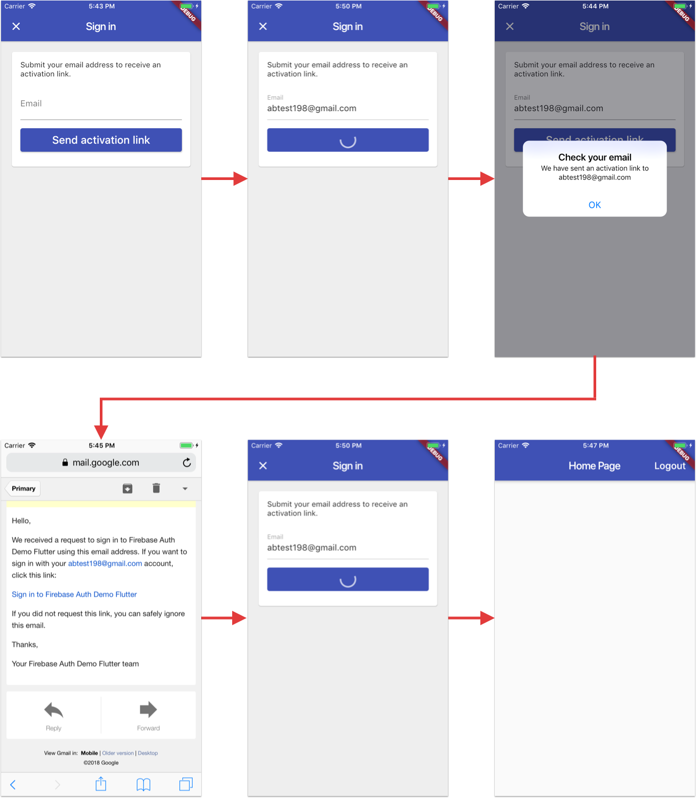

# Sign-in with email link (passwordless)

According to the Firebase documentation:

> You can use Firebase Authentication to sign in a user by sending them an email containing a link, which they can click to sign in. In the process, the user's email address is also verified.

The Firebase docs include setup guides for [iOS](https://firebase.google.com/docs/auth/ios/email-link-auth) and [Android](https://firebase.google.com/docs/auth/android/email-link-auth).

This document complements this information by providing setup instructions for Flutter, including:

- how to configure passwordless sign-in for iOS & Android with dynamic links in Firebase
- how to setup the Flutter project
- how this is implemented in this reference demo app

## Setup steps

To configure passwordless sign-in in Flutter, open the Firebase console for your project, and follow **all** these steps:

### 1. Firebase Dynamic Links page

The first step is to add a URL prefix that represents a custom Dynamic Links domain:


In this example, we use `firebaseauthdemoflutter.page.link` as a Google-provided domain.

Once this is done, a new dynamic link can be created.

This opens up a wizard with a number of steps:


After completing all the steps, the dynamic links page will look like this:




### 2. Authentication -> Sign-in method

Enable both Email/Password and Email link as a sign-in method:



Scroll to the bottom of the page, and note the name of the authorized domains:


This will be needed when configuring the link in the code.

### 3. Firebase project settings

**Ensure that the support email is set.** It's amazing how many people trip up by forgetting this. 🤯

I'll say it again: **Ensure that the support email is set.**

If not already done: 

- add an Android app and set the **package name**, the **SHA-1** and **SHA-256 fingerprints**.



- add an iOS app and set the **Bundle ID**, **App Store ID** and **Team ID**.



Use the (?) tooltips for instructions on the steps above.

### 4. Android setup

Open the `AndroidManifest.xml` (normally in `android/app/src/main`) and add the following lines - **with the correct dynamic link domain** - inside the main activity:

```
<intent-filter>
    <action android:name="android.intent.action.VIEW"/>
    <category android:name="android.intent.category.DEFAULT"/>
    <category android:name="android.intent.category.BROWSABLE"/>
    <data android:host="firebaseauthdemoflutter.page.link" android:scheme="https"/>
    <data android:host="firebaseauthdemoflutter.page.link" android:scheme="http"/>
</intent-filter>
```

### 5. iOS setup

Open the capabilities tab for the Runner target in the Xcode project settings, then:

- enable Associated Domains
- add your dynamic link domain. Example: `applinks:firebaseauthdemoflutter.page.link`


A couple of checkmarks will show if code signing is configured correctly.

### 6. Flutter setup

Once the steps above are complete, the iOS & Android projects are ready to go. 🚀

Open the `pubspec.yaml` file and install `firebase_dynamic_links`. Example:

```
dependencies:
  firebase_dynamic_links: 0.5.0
```

**Sending activation links**

Finally, start the sign-in process by making a call to the `sendSignInWithEmailLink` method of `FirebaseAuth`.

In this project, this code is encapsulated inside the `FirebaseEmailLinkHandler` class, and uses the data from `PackageInfo` to retrieve the package name:

```dart
final PackageInfo packageInfo = await PackageInfo.fromPlatform();
// Send link
await widget.linkHandler.sendSignInWithEmailLink(
    email: _email,
    url: Constants.firebaseProjectURL,
    handleCodeInApp: true,
    packageName: packageInfo.packageName,
    androidInstallIfNotAvailable: true,
    androidMinimumVersion: '21',
);
```

**Note**: the `Constants.firebaseProjectURL` value above is defined like so in this project:

```dart
class Constants {
  // TODO: Replace this with your firebase project URL
  static const String firebaseProjectURL = 'https://fir-auth-demo-flutter.firebaseapp.com/';
}
```

This is defined in the authorized domains at the bottom of the the Firebase sign-in method page:


That's it. If everything is configured correctly, you can run your app and send activation links to any email address.

If something is wrong, the `sendSignInWithEmailLink` method will throw an exception explaining the cause.

**Receiving activation links**

This requires quite a bit of code to process incoming links with the `firebase_dynamic_links` package.

See the relevant classes in this project for a full implementation:

- `FirebaseEmailLinkHandler` (tests in `firebase_email_link_handler_test.dart`)
- `EmailLinkSignInPage`
- `EmailLinkErrorPresenter`

## User flow

Once setup is done (see steps above), the user can sign-in via email link by following this sequence:



In summary:

- the user can enter and sumbit her email address to Firebase
- Firebase sends an email with an activation link to that address
- the user taps on the link, and is taken back to the app
- the app signs in the user if the link is valid and not already used

Bingo! 😎

## Is anything missing?

Help fixing the documentation by [opening a PR](https://github.com/bizz84/firebase_auth_demo_flutter/pulls). 😇

## Additional references

The official docs have guides for setting things up on iOS and Android:

- [Authenticate with Firebase Using Email Link in iOS](https://firebase.google.com/docs/auth/ios/email-link-auth)
- [Authenticate with Firebase Using Email Link in Android](https://firebase.google.com/docs/auth/android/email-link-auth)
